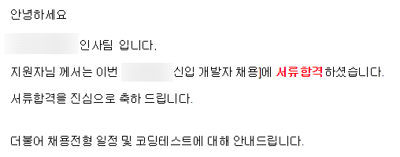
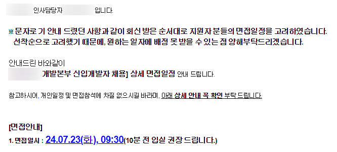
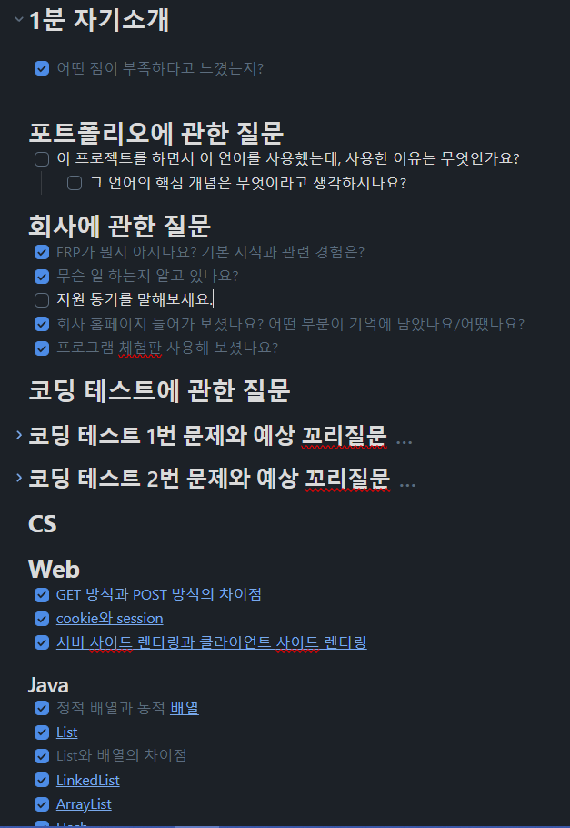
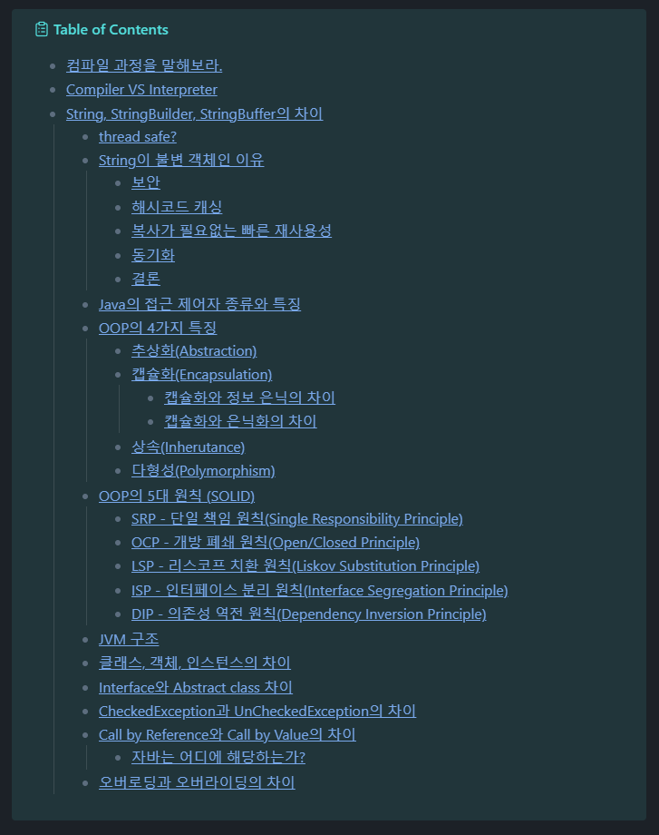
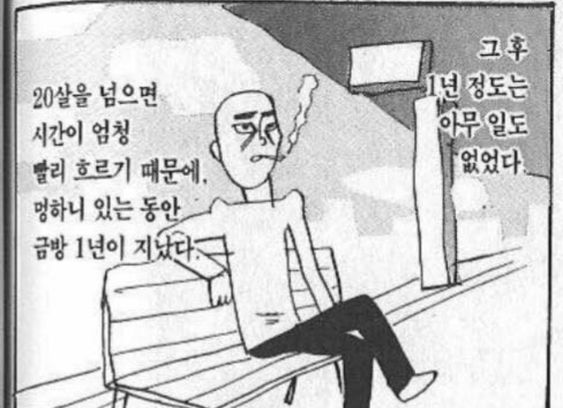

# 신입 개발자 첫 기술 면접 회고
> 면접 장렬하게 말아먹고 하루 종일 이불 차다가 남겨보는 후기

처음 서류 합격 소식은 문자로 받았다.

평소 스팸 문자 말곤 문자 날아올 일이 없는데.. 아무 생각 없는 상태에서 받은 거라 진짜 얼떨떨했다. 

서류 합격 고지를 받고 이틀 후 쯤 코딩 테스트가 예정되어 있었다.
최근에는 개인 프로젝트 개발 한다고 알고리즘 문제 풀이를 놓고 있었어서 감도 찾을 겸 백준이나 프로그래머스 문제를 풀어보려고 했는데 당장 모레 시험이라고 하니 문제도 잘 안 읽히더라.. 그냥 벼락치기는 포기하고 평소에 알고리즘 문제 풀었던 걸 믿어보기로 했다. 역시 코딩 테스트 공부는 꾸준히 미리미리 하는 게 중요하다는 걸 느꼈다.

# 코딩 테스트
코딩 테스트는 정해진 날짜 중 본인이 편한 시간을 골라서 **2문제를 4시간 동안** 풀어야 했다. 솔직히 시간이랑 문제 수 보고 너무 무서웠당😂 문제 수가 적고 시간이 길다는 건 그만큼 구현이 어려운 문제가 나올 거라고 예상했기 때문에..

크아악 불안이 내 머릿 속에서 나가

체감상 백준 실버 상위~골드 하위 티어 정도의 문제가 나왔다. 문제 풀이 자체는 어렵지 않게 생각할 수 있었는데 `N`의 최대 값이 500,000이 넘어가서.. 시간 복잡도를 고려해서 푸는데에 시간이 오래 걸렸다. 끝나고 보니 4시간 중에 3시간 30분 정도 푼 듯. **Stack, 이진 탐색 트리, 누적합** 알고리즘을 사용해 각각 `O(N), O(N log N)` 시간 복잡도로 풀 수 있었다.

코딩 테스트 결과는 합격!

면접 이후에는 미리 해당 기업 면접 후기를 샅샅이 살펴보면서 예상 질문 리스트를 만들었다.

20살 때 쯤 면접 볼 때 1분 자기소개 준비 안 해갔다가 너무 당황해서 다음 질문까지 우르르 망쳐봤던 경험이 있어서 이번엔 자기소개에 좀 신경썼다. 근데 사실 자기소개는 그렇게 중요하지 않다고 하기도 하고(~~심지어 이번 면접에서는 아예 안 물어봤다~~) 외운 티 나면 이상하기도 해서 다음부턴 가볍게 준비하는 편이 좋을 듯

기술 질문이 깊게 들어온다는 후기가 많아서 후기에 적혀 있던 개념들, 그리고 기술 면접 빈출 문제까지 싹싹 긁어 모아 정리하기 시작했다. 정리하면서 든 생각은.. 내가 지금까지 **이해 기반으로 공부한 게 아니라 단순히 암기한 부분이 많다**라는 거. 분명 대학교 때 배운 개념인데도 막상 '~에 대해 설명해보세요.' 하면 답변이 안 나오는 것들이 부지기수였다. 안다고 생각했던 것도 조금만 응용하면 대답할 수가 없었다. 일단 최대한 이해할 수 있는 부분은 이해해보고 안되면 달달 외우기라도 하자 생각했다😂

그 외에도 내가 풀었던 문제에 대한 꼬리 질문을 예상해서 정리하고, 해당 회사의 최근 이슈,  체험 프로그램을 사용해 보면서 관련 질답에 대해 생각해봤다. 지원 동기나 입사 후 포부 같은 필수 질문들도 같이. 바쁘게 일주일을 보냈던 것 같다.

# 대망의 면접
20분 정도 일찍 도착해서 면접비를 받고(아싸) 명찰 달고 대기하고 있으니까 묘하게 차분해졌다. 인사 담당자 분이 분위기를 풀어주려고 엄청 노력하시기도 했다.

다대다 면접이라 내 타임에는 총 면접관 세 명, 면접자 세 명으로 이루어졌다. 간단한 인적사항이나 아이스 브레이킹용 질문을 각 지원자마다 해주시고 본격적인 기술 면접에 들어갔다. 그리고 난 본격적으로 병풍이 되었다🤣

근데 솔직히 억울하거나 슬프다거나 그렇진 않았다.. 오히려 이 자리에 앉아서 머릿수라도 채웠던 게 영광이었다. 왜냐면 나랑 같이 본 다른 지원자 분이 답변 하시는 걸 듣고 있으니 나와는 확실히 달랐다. 실제로 프로젝트를 진행하면서 느꼈던 어려웠던 점, 프로젝트의 성능을 개선했던 경험이 잘 드러나서 내가 면접관 이었어도 그분한테 궁금한 점이 더 많았을 것 같았다. 난 포폴에 대한 제대로 된 설명도, 사용해봤던 기술 스택에 대한 설명도 없었으니 뭘 물어봐야 할지 난감하셨을듯.. 그때부턴 그냥 체념하고 하나라도 더 배워가자는 심정으로 질문과 답변을 이해하는데 초점을 뒀다.

## 면접 질문 복기
- 학교를 왜 이렇게 먼 곳으로 다녔는지?
- 왜 이렇게 학점이 높은지?
	- 보통 학점은 중간 정도로 유지하고 대외활동을 하는 경우가 많다고 하셨다. 난 교내활동 위주에 개발 관련 성과가 크게 없어서 문제가 된 듯😭
- HashMap의 내부 동작이 어떻게 이루어지는지?
- HashMap에서 해시 충돌이 일어날 수 있다고 했는데 이걸 어떻게 알아낼 수 있는지?
- 자바에서 의존성 주입을 위해 어노테이션을 사용하는 방식에 대해 어떻게 생각하는지?
- 회사에 대한 질문은 없는지?
- ~한 상황을 가정했을 때 동기 방식이 빠른지, 비동기 방식이 빠른지?
	- 이건 다른 지원자 분이 프로젝트에서 겪은 상황에 대한 꼬리 질문인데, 어떤 상황인지 정확히 이해하지 못해서 잘 기억이 안난다. 일반적으로 비동기 방식이 빠르다고 생각해서 답변 드렸는데 같다고 말씀하시고 어떤 경우에는 비동기 방식이 더 느릴 수도 있다고 하심.

면접을 끝내면서 이렇게 된 거 어떤 부분을 공부하면 좋은지 알아가자 싶어서 '지금 면접관과 면접자의 입장으로 만나뵙게 되긴 했지만, 개발자 선배님으로서 이 정도 개념은 알아뒀으면 좋겠다! 하는 부분이 있는지' 여쭤봤다. 답변으로는 아까 말했던 자주 사용하는 **자료구조의 내부 동작**은 기본적으로 알았으면 좋겠고, **사용하는 기술에 대해 가져다 쓰는 것보단 어떻게 동작하는지 탐구하는 자세**를 가졌으면 좋겠다고 말씀하셨다.

## 그리고 면접이 끝나고 느낀 점
솔직히 지금도 부끄러워서 죽고싶다..^^ 사실 제대로 대답한 것도 거의 없지만 중간부터는 말꼬리도 흐려지고 대놓고 당황한 티가 났다. 당황하니까 질문에 집중이 안돼서 혼자 중얼거리면서 질문 되뇌이기도 했음.. 조용하니까 다 들렸겠지.

그런 것 말고도 내 실력이 너무 적나라하게 드러난 것 같아서, 다른 사람들은 저만큼 열심히 공부하는데 난 요행을 바라고 있었구나. 막말로 **주제 파악을 못하고 있었다**는 게 느껴져서 부끄러웠다.
대학을 졸업하고 1년 남짓 대충 서류 몇 장이나 찌끄리고 전단지 돌리듯 이력서를 넣어서 되는 게 아니었다.

그리고 솔직히 내가 **개발자 적성에 맞나?** 라는 고민도 하게 됐었다. 내가 만난 실력있는 개발자들은 공통적인 특성이 있었다. 하나에 빠지면 무조건 끝장을 봐야 하는 것, 궁금한 게 생기면 다 뒤짚어 엎어서라도 알아내야 하고 조립하거나 뜯어 고치길 좋아한다는 것. **뭔가를 미친듯이 덕질해본 경험**이 있다는 거다.

내가 지금 그런 사람이지는 않지만, 그나마 다행인 건 **그런 사람들을 동경하고 있다**는 거다.

늘 배우고, 성장하고, 그게 뭐든지 자신의 분야에 푹 빠진 사람들은 정말 멋있다. 그렇게 되고 싶다고 늘 생각한다. 이번 면접을 다녀오고 나서, 내가 저기 있는 사람들만큼 노력할 수 있을까? 하는 불안함과 꼭 저렇게 되고 싶다는 감정이 동시에 들었다.

고등학교 때부터 지금까지 거의 6~7년 가까운 시간 동안 개발을 꼭 국영수사과 공부하듯 그냥 해야하는 거라고 생각했고 언젠가 해결해야 할 숙제처럼 느껴졌다. 그래서 재미도 없고, 실력도 안 늘고 자아만 비대해진 것 같다.

그걸 객관적으로 볼 수 있었다는 점만 해도 이번 기술 면접은 유익했던 것 같다.

다른 사람들은 개발자가 되기 위해 어떤 노력을 하고 있으며, 그걸 따라잡기 위해 앞으로 어떻게 해야 할지 방향을 잡을 수 있었다. 어차피 지나간 시간에 대해 후회해봤자 되돌릴 수 있는 건 하나도 없으니.. 당장 지금부터라도 내가 할 수 있는 노력을 해야겠다는 다짐을 했다.

# 결론
1. CS랑 Java 공부하자. -> 그냥 만들어져 있는 걸 사용하는 데만 그치지 말고 왜 사용하는지? 어떤 불편함을 해결하기 위해 만들어졌는지 생각해보면서 제대로 공부하자.
2. 코딩테스트 문제 풀이는 꾸준히 하자.
3. 난 허접이라는 사실을 늘 상기하자. 남들은 학생 때부터 나보다 백 배는 더 열심히 살았다.
4. 뭐라도 만들어서 배포해 보자.